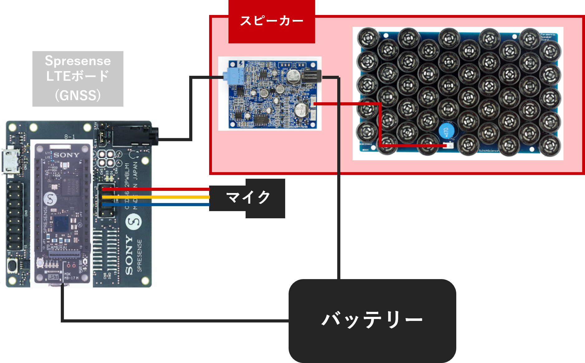
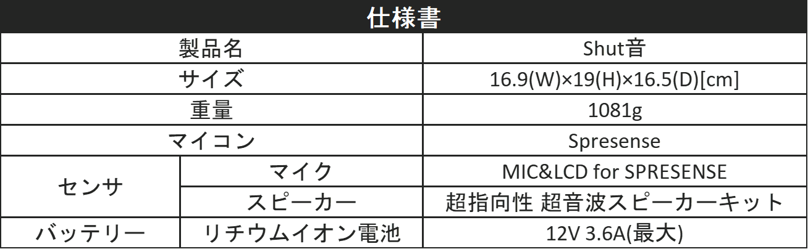
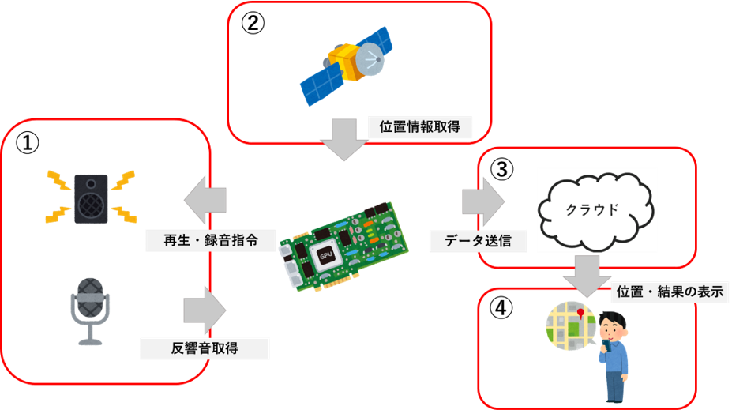

# Shut音

## 製品の概要
本製品は物件の防音性能を手軽に評価するデバイスになります。

ただし、現段階では未実装部分もあることに注意してください。

また、この製品にはSpresenseのLTE拡張ボードが必要となります。

## ビルド
1.SpresenseのArduinoプロジェクトがビルドできる状態にします(詳細はSonyのSPRESENSE公式ページをご覧ください)。

2.ArudinoIDEでMAinフォルダにあるMain.inoを開いてください。

3.SpresenseをPCに接続します。また、マイクとスピーカーも接続します。

3.1.SDフォルダの中身をSDカードに移し替えて、SDカードをSpresenseに挿してください。

4.Main.inoをSpresenseに書き込みます。

## センサーについて
この製品を扱うにあたって、Spresenseち各センサーの接続は以下の画像を参考にしてください。



また、我々が設計した際の仕様書は以下の通りになります。実際に求めるマイクとスピーカー、バッテリーのスペックは何段階か下げても問題ないと思われます。



## 使い方(予定)
1.スケッチの書き込み、センサーの接続を終えます。

2.壁に向かって、マイクとスピーカーを向けたら、スイッチをONにします。

3.GPSの座標を取得するために外に出るて30秒ほどお待ちください。

4.座標と反響音を取得次第、クラウドへデータを送信し、防音性能の評価を行います。他のデバイスで評価結果をご確認ください。

## クラウド側のシステム・環境要求
- Ubuntu 18.04/20.04
- CPython >= 3.6

## クラウド側のインストール方法と使い方
```bash
bash aws/install.sh # Install requirement packages and modules

cd aws/backend && python3 server.py # Run the server
```

## 機能(予定)
本製品の機能は以下の通りです。

・Spresenseの高い精度のGNSSを用いた座標取得

・スピーカーから壁へ音を照射し、その反響音をマイクで録音

・クラウド側で取得した録音データと基準となる反響音データと比較して、防音性能を評価

・地図上への座標と防音性能を保存

詳しくは以下の動画をご覧ください。

[](https://user-images.githubusercontent.com/93237025/148518990-fd2f7766-0817-4d73-b0f5-9052ba7b677b.mp4)

## システムモデル

本製品のシステム構成図のイメージ図は以下の通りです。



## 実装部分・未実装部分

### 実装部分

録音・再生・位置情報取得・防音性能評価・データ管理

### 未実装部分

クラウドとSpresense間の通信(LTE拡張ボードがないため実装不可)